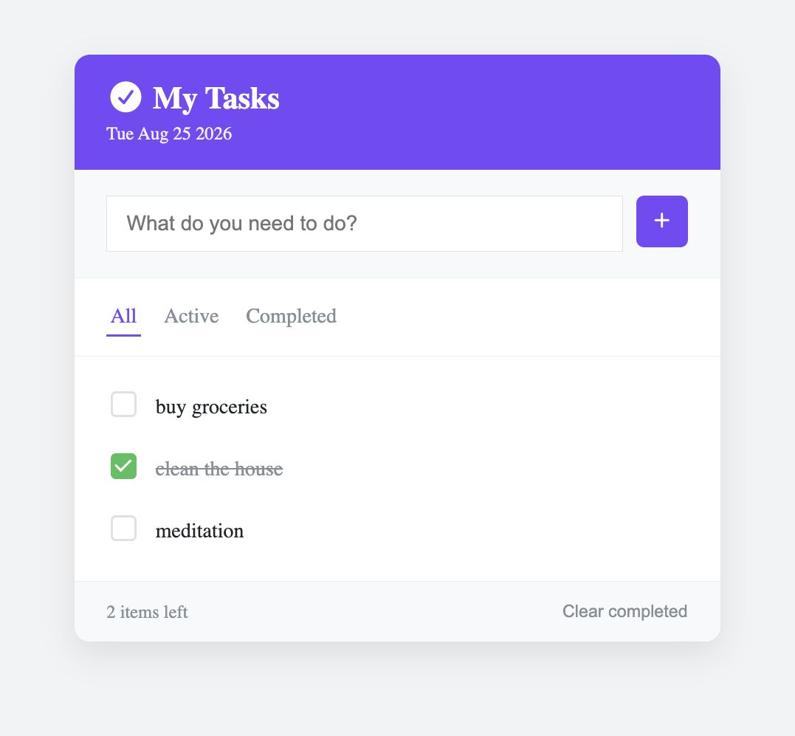

# Todo App

A responsive JavaScript todo app for managing daily tasks.
## Live Demo

Try the app here: https://lavim708.github.io/todo-app/

## Preview

## Features

- Add new tasks
- Mark tasks as completed
- Delete tasks
- Filter by All, Active, and Completed
- Clear completed tasks
- Persistent storage using localStorage
- Live count of remaining tasks
- Empty-state handling
- Add tasks using the Enter key
- Displays the current date

## Built With

- HTML
- CSS
- JavaScript

## What I Learned

This project helped me understand how to manage application state using JavaScript, render UI from data,
work with array methods such as `map()` and `filter()`, and persist data using `localStorage`.
